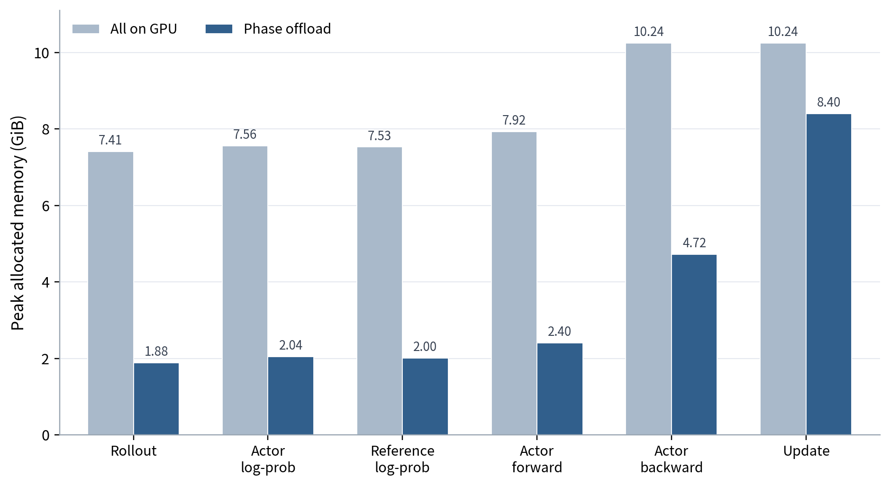
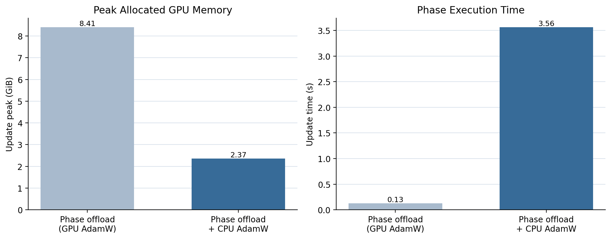
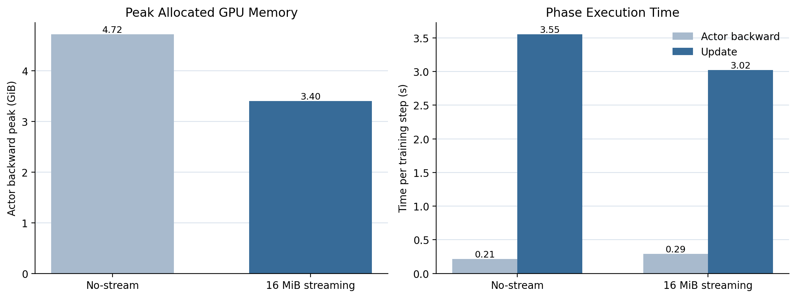
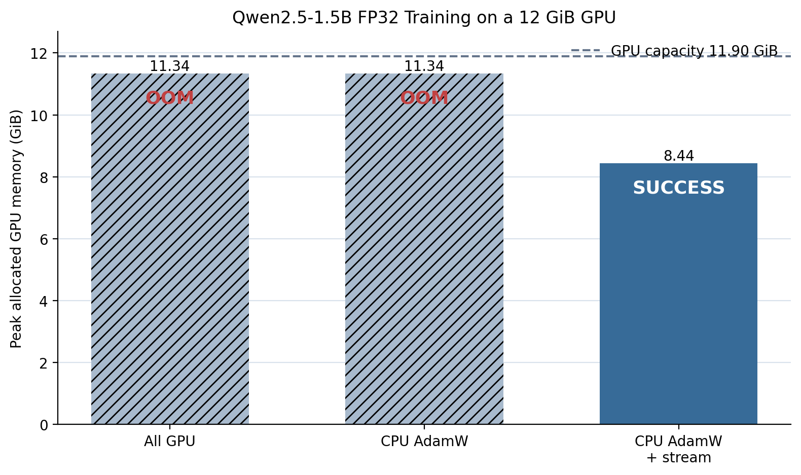

# Phase-Aware Offloading for Single-GPU VERL Training

This repository contains the implementation, experiment drivers, curated data,
and analysis for memory-efficient full-parameter GRPO training on a single GPU.
It extends [verl](https://github.com/verl-project/verl) with phase-aware model
residency, CPU AdamW, and asynchronous gradient streaming.

The study asks a practical question:

> Can the sequential structure of GRPO be used to train a model that otherwise
> exceeds GPU memory, without treating every parameter, gradient, and optimizer
> state as simultaneously resident?

The answer under the tested setup is yes. Phase offloading removes inactive
Actor/Reference state, CPU AdamW removes GPU optimizer state, and 16 MiB
gradient buckets reduce the Actor-backward peak while overlapping CPU update
and parameter reload.

## Highlights

- **Phase-exclusive residency:** Actor and Reference parameters occupy the GPU
  only in phases that use them.
- **CPU optimizer path:** FP32 Adam state and update computation remain on CPU.
- **Bounded gradient streaming:** backward hooks pack ready gradients into
  bounded buckets, copy them asynchronously to pinned CPU buffers, and release
  GPU gradients early.
- **Pipelined update:** CPU Adam bucket updates overlap with parameter H2D.
- **Reproducible evidence:** every run used by the reported comparisons is
  preserved with its configuration, measurements, and logs.

## Main results

Unless noted otherwise, the reference comparison uses Qwen2.5-0.5B-Instruct,
full-parameter FP32 training, GSM8K, one NVIDIA TITAN Xp with 11.90 GiB usable
capacity, two warm-up steps, and three repeated runs. The GPU/CPU AdamW runs
measure 30 of 32 training steps; the optimized streaming runs measure 28 of 30.
Performance bars use telemetry-off runs and memory bars use corrected
phase-local peaks.

### 1. Phase offloading removes inactive residency



Across the six GRPO phases, phase offloading reduces the Actor-backward peak
from **10.24 GiB to 4.72 GiB**. GPU AdamW still raises Update to 8.40 GiB,
which motivates moving the optimizer computation itself to CPU.

### 2. CPU AdamW removes the Update memory peak

| Configuration | Update peak | Update time |
|---|---:|---:|
| Phase offload + GPU AdamW | 8.408 GiB | 0.129 s |
| Phase offload + CPU AdamW | 2.365 GiB | 3.565 s |

CPU AdamW eliminates the GPU optimizer-state peak, but a serial CPU update is
much slower. This result isolates memory placement from the later streaming and
overlap optimizations.



### 3. Optimized gradient streaming lowers memory and total update time

| Configuration | Backward peak | Backward | Update | Actor update | Step |
|---|---:|---:|---:|---:|---:|
| No streaming | 4.721 GiB | 0.212 s | 3.551 s | 5.152 s | 9.814 s |
| 16 MiB, 3 slots, Adam–H2D overlap | 3.402 GiB | 0.292 s | 3.020 s | 3.964 s | 8.629 s |

The optimized path reduces the backward peak by **1.319 GiB (27.9%)** and the
end-to-end step by **1.186 s (12.1%)**. Backward itself becomes about 80 ms
slower because hooks, packing, D2H traffic, and staging-slot backpressure run on
its critical path; the pipelined Update more than recovers that cost.



The optimized streaming setting is:

```text
bucket size                 16 MiB
staging slots               3
asynchronous D2H            enabled
early gradient release      enabled
reusable packing buffers    enabled
direct CPU gradient buffers enabled
CPU gradient accumulation   enabled
Adam–parameter H2D overlap  enabled
```

### 4. Capacity result on Qwen2.5-1.5B

All-GPU and CPU-Adam-without-streaming runs reached OOM on the 11.90 GiB GPU.
CPU Adam plus gradient streaming completed, with a phase-local peak of
**8.44 GiB** (the direct performance metric is approximately 8.377 GiB).



## Method

GRPO executes distinct phases sequentially:

```text
Rollout
  -> Actor log-prob
  -> Reference log-prob
  -> Actor forward
  -> Actor backward
  -> Update
```

The implementation exploits this schedule in three layers:

1. Move inactive Actor/Reference parameters out of GPU memory at phase
   boundaries.
2. Keep FP32 master parameters and Adam states on CPU.
3. During backward, stream ready gradients to CPU in bounded buckets; update
   CPU parameter buckets and copy updated parameters back without waiting for a
   monolithic optimizer phase.

The detailed design, controls, measurement boundaries, commands, and known
limitations are in [Experiment guide](docs/EXPERIMENTS.md).

## Reproduce

### Clone and install

The modified verl implementation is tracked as a submodule.

```bash
git clone --recurse-submodules https://github.com/2Ju1/verl-research.git
cd verl-research

python3.10 -m venv .venv
source .venv/bin/activate
python -m pip install --upgrade pip
pip install -r constraints-cu118.txt \
  --index-url https://download.pytorch.org/whl/cu118
pip install -r requirements-lock.txt
pip install -e src/verl
```

Prepare GSM8K if the checked-in sample is not used:

```bash
python src/verl/examples/data_preprocess/gsm8k.py \
  --local_save_dir "$PWD/data/gsm8k"
```

### Run a matrix

The commands below reproduce the two central isolated comparisons. Raw output
is written under `outputs/`, which is intentionally ignored by Git.

```bash
# Phase-offload GPU AdamW vs phase-offload CPU AdamW
.venv/bin/python \
  src/verl/benchmarks/offload/run_matrix.py \
  --matrix benchmarks/offload/configs/phase_best_vs_cpu_adamw.json \
  --output outputs/phase-best-vs-cpu-adamw-performance-v1 \
  --repeats 3 --warmup-steps 2

# Historical 16--512 MiB bucket sweep (Adam--H2D overlap was OFF)
.venv/bin/python \
  src/verl/benchmarks/offload/run_matrix.py \
  --matrix results/data/05_bucket_size_sweep_05b/optimized_bucket_sweep.json \
  --output outputs/pa-optimized-bucket-sweep-v1 \
  --repeats 3 --warmup-steps 2
```

Machine-specific paths and the overlap-enabled pipeline procedure are
documented in [Experiment guide](docs/EXPERIMENTS.md). Do not compare the
historical bucket sweep's Update time directly with the overlap-enabled
16 MiB result.

## Repository map

```text
src/verl/                     Modified verl submodule and offload engine
benchmarks/offload/           Top-level benchmark entry points/config stubs
data/gsm8k/                   Small benchmark dataset
docs/EXPERIMENTS.md           Experimental design and reproduction guide
reports/                      Technical reports
results/                      Result index and provenance manifest
results/figures/              Four primary result figures (PNG)
results/plotting/             Figure regeneration scripts
results/data/                 Raw evidence grouped by comparison
```

Start with these artifacts:

- [Experiment guide](docs/EXPERIMENTS.md)
- [Engineering insights and debugging notes (Korean)](docs/ENGINEERING_INSIGHTS_KO.md)
- [Korean study report](reports/STUDY_REPORT_KO.md)
- [Result index](results/README.md)

## Data interpretation rules

- `allocated`, allocator `reserved`, and driver-visible device memory are
  different metrics and are never merged into one bar.
- OOM runs are capacity evidence, not samples in performance averages.
- `--detail`, transfer telemetry, synchronization, and Nsight perturb runtime;
  reported performance comes from telemetry-off repetitions.
- Update time is read from the direct Adam/update timer. The obsolete residual
  estimate (`actor update - forward - backward`) is excluded.
- The 16--512 MiB sweep predates Adam–H2D overlap and is diagnostic only.
- The Nsight decomposition of the remaining backward overhead is incomplete;
  the repository does not present it as a finished causal attribution.

## Software and hardware baseline

| Component | Version/setup |
|---|---|
| OS | Ubuntu 22.04 family |
| Python | 3.10.12 |
| CUDA runtime | 11.8 |
| PyTorch | 2.4.1+cu118 |
| verl base | v0.4.1-derived |
| GPU | Single GPU, CUDA-reported capacity 11.90 GiB |
| Primary models | Qwen2.5-0.5B-Instruct and Qwen2.5-1.5B |
| Dataset | GSM8K |

The parent repository pins the modified implementation through the `src/verl`
submodule. Exact run settings are preserved in each curated `run.json`.
